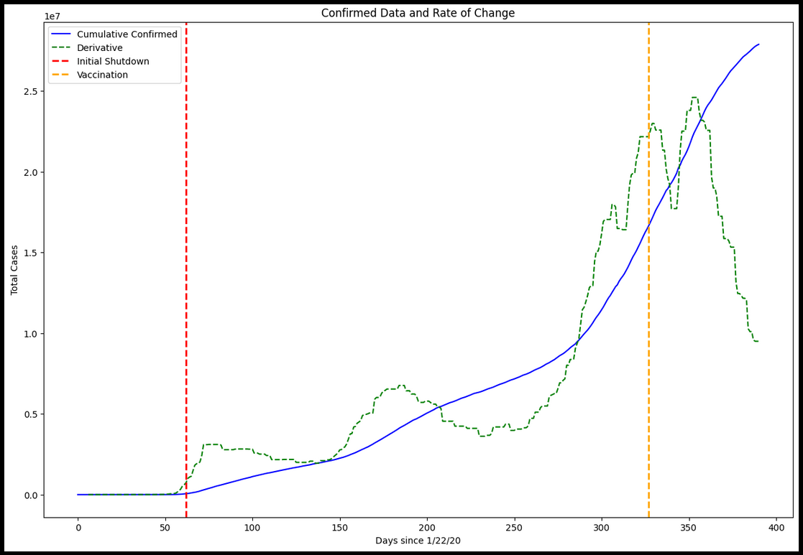
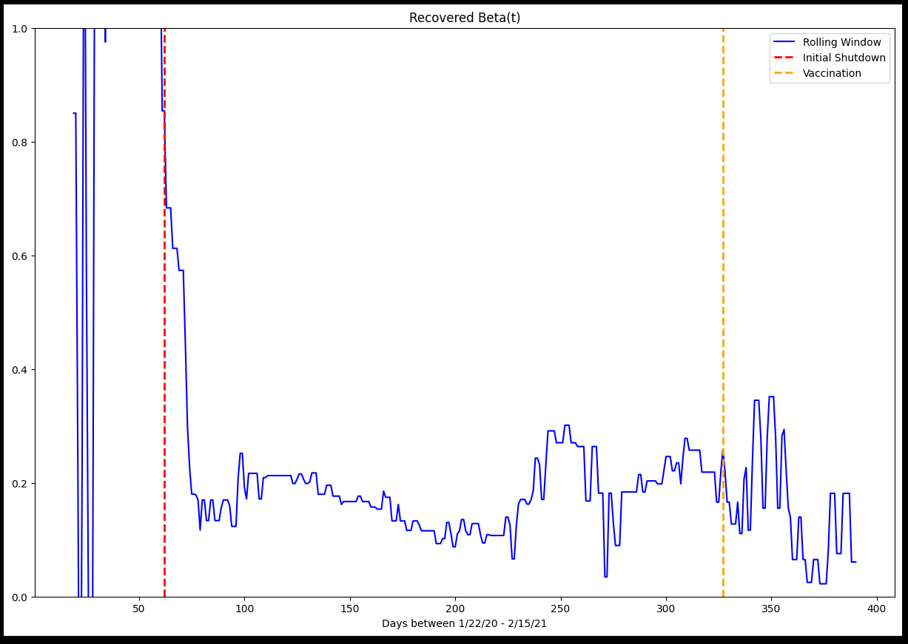
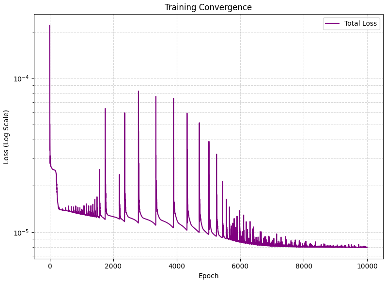

# Physics-informed-Neural-Network-in-JAX-COVID-SIERD
A JAX-based Physics-Informed Neural Network (PINN) designed to model COVID-19 dynamics. It utilizes a custom SEIRD compartmental model, incorporating real-world US data to estimate time-varying parameters like transmission rates. Features RK4 numerical integration and neural fields to predict disease trajectory accurately.

Unlike standard "black-box" models, this architecture embeds the **SEIRD** (Susceptible-Exposed-Infectious-Recovered-Dead) differential equations directly into the learning process, ensuring that the predicted trajectories remain physically and biologically consistent with the laws of epidemic growth.
 

 
## 1. The SEIRD Compartmental Model
 
The foundation of this project is a 6-compartment version of the SEIR model. We define the state vector $\mathbf{y}(t)$ as:
 
$$\mathbf{y}(t) = \left[ S(t),\ E(t),\ I(t),\ R(t),\ D(t),\ C(t) \right]^{\top}$$
 
The system is governed by the following system of non-linear ordinary differential equations (ODEs):
 
$$\frac{dS(t)}{dt} = -\frac{\beta}{N} S(t)\, I(t)$$
 
$$\frac{dE(t)}{dt} = \frac{\beta}{N} S(t)\, I(t) - \sigma E(t)$$
 
$$\frac{dI(t)}{dt} = \sigma E(t) - \gamma I(t)$$
 
$$\frac{dR(t)}{dt} = (1 - \alpha)\, \gamma I(t)$$
 
$$\frac{dD(t)}{dt} = \alpha\, \gamma I(t)$$
 
$$\frac{dC(t)}{dt} = \lambda\, \gamma I(t)$$
 
### Parameter Definitions
 
| Symbol | Name | Description |
|--------|------|-------------|
| $N$ | Total Population | Assumed constant throughout the simulation. |
| $\beta$ | Transmission Rate | The rate at which infectious individuals interact and infect susceptible ones. |
| $\sigma$ | Incubation Rate | The inverse of the incubation period (time spent in the Exposed compartment). |
| $\gamma$ | Recovery/Removal Rate | The inverse of the infectious period. |
| $\alpha$ | Infection Fatality Rate (IFR) | The probability that an infection leads to death. |
| $\lambda$ | Reporting Fraction | The proportion of true infectious cases that are actually confirmed in the data. |
 
---
 
## 2. Neural ODE & MLP Architecture
 
At the core of the solver is a **Multilayer Perceptron (MLP)** that acts as a universal function approximator for the vector field.
 
### The Multilayer Perceptron (MLP)
 
The neural network learns the mapping $f : \mathbb{R}^6 \to \mathbb{R}^6$, parameterized by weights and biases $\theta$. For a hidden layer $l$, the operation is:
 
$$\mathbf{h}_l = \tanh\!\left( W_l\, \mathbf{h}_{l-1} + \mathbf{b}_l \right)$$
 
The final output is a linear transformation:
 
$$\hat{\mathbf{y}}' = W_L\, \mathbf{h}_{L-1} + \mathbf{b}_L$$
 
### The Neural ODE Formulation
 
In a Neural ODE, the network does not predict the state $\mathbf{y}(t)$ directly. Instead, it predicts the **derivative** (the rate of change) of the system at any given point:
 
$$\frac{d\mathbf{y}}{dt} = \mathrm{NN}\!\left(\mathbf{y}(t);\, \theta\right)$$
 
This allows the model to learn the **underlying dynamics** of the epidemic rather than just fitting a static curve.
 

 
## 3. Numerical Integration: The RK4 Solver
 
To evolve the system through time, we use a **4th-Order Runge-Kutta (RK4)** integration scheme. RK4 provides a much higher degree of accuracy than simple Euler methods by sampling the slope at four distinct points within each time step $\Delta t$:
 
$$k_1 = f\!\left(\mathbf{y}_n,\, \theta\right)$$
 
$$k_2 = f\!\left(\mathbf{y}_n + \frac{\Delta t}{2}\, k_1,\, \theta\right)$$
 
$$k_3 = f\!\left(\mathbf{y}_n + \frac{\Delta t}{2}\, k_2,\, \theta\right)$$
 
$$k_4 = f\!\left(\mathbf{y}_n + \Delta t\, k_3,\, \theta\right)$$
 
**The Update Rule:**
 
$$\mathbf{y}_{n+1} = \mathbf{y}_n + \frac{\Delta t}{6}\left( k_1 + 2k_2 + 2k_3 + k_4 \right)$$
 
---
 

## 4. Training and Loss Functions
 
The model is optimized using the **Adam optimizer** with an exponential learning rate decay. The loss function is a Mean Squared Error (MSE) computed over a sliding window of the time series to capture temporal dependencies:
 
$$\mathcal{L}(\theta) = \frac{1}{T} \sum_{t=1}^{T} \left\| \mathbf{y}_{\text{true}}(t) - \mathbf{y}_{\text{pred}}(t;\, \theta) \right\|^2$$
 
This project addresses the **identification problem**: because many parameters can produce similar short-run fits but vastly different long-run forecasts, we use data-driven regularization to stabilize the estimation of $\beta$ and the basic reproduction number $\mathcal{R}_0$.
 

 
## 5. Visualizations & Interpretability
 
The project generates several key visualizations to assess model performance. When reviewing the output, look for:
 
- Shows the evolution of $C$ over time. A successful model will show the "Exposed" curve peaking *before* the "Infectious" curve.

---

- A plot showing how the transmission rate $\beta$ changes over time — this typically drops following social distancing or lockdowns.

---

- A log-scale plot of the loss history to ensure the Neural ODE has successfully minimized the residuals of the SEIRD equations.

 
## Technical Stack
 
| Library | Role |
|---------|------|
| **JAX** | Autodiff and XLA acceleration |
| **Optax** | Gradient processing and optimization |
| **Diffrax** | Numerical differential equation solvers in JAX |
| **Pandas / Matplotlib** | Data ingestion and visualization |
 
---
 
*This project was developed as a capstone exploration into the intersection of Physics-Informed Machine Learning and public health crisis modeling.*
 